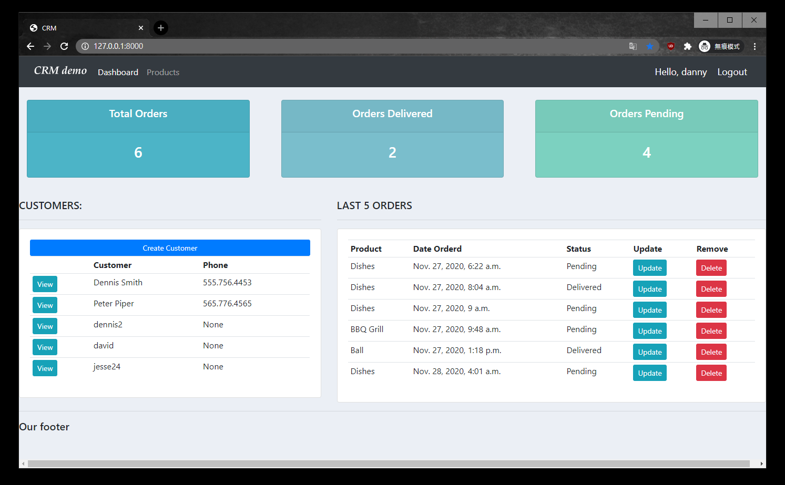

# CRM-Website 
CRM website built with django
Project for the Django Crash Course 
(By Dennis Ivy. https://www.youtube.com/playlist?list=PL-51WBLyFTg2vW-_6XBoUpE7vpmoR3ztO)

# Functions:
1. only for logged in users
2. customer v.s. admin user

# Tech & Tools: 

# To use:

