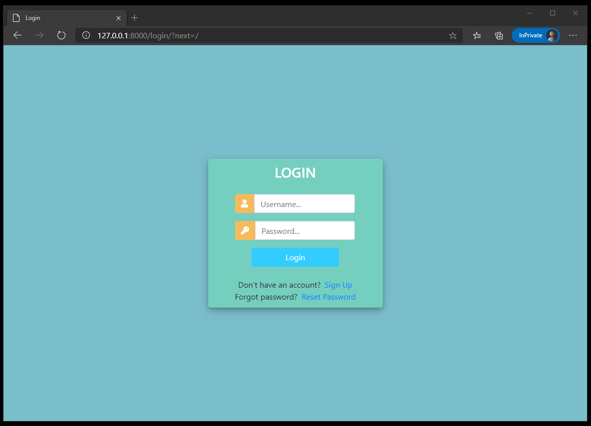
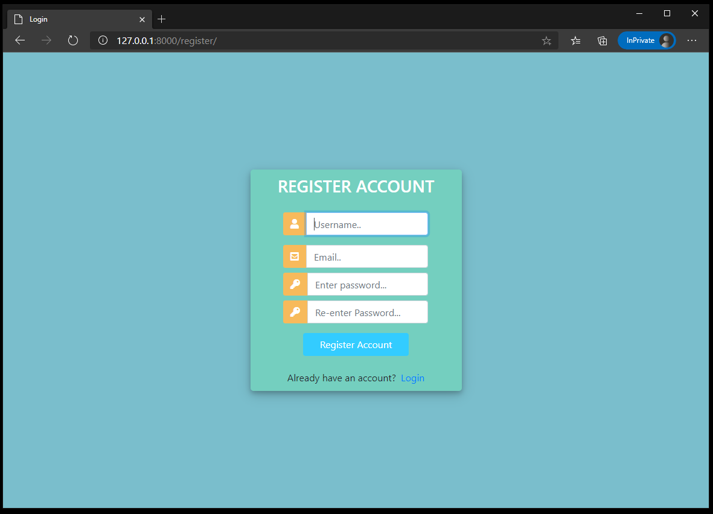

# CRM-Website 
CRM website built with django  
Project for the Django Crash Course taught by Dennis Ivy.  
(https://www.youtube.com/playlist?list=PL-51WBLyFTg2vW-_6XBoUpE7vpmoR3ztO)

# Tech & Tools:
1. Backend: Django 3.1.3
2. Frontend: Bootstrap 4.3.1 
3. Database: SQLite

# To use:
1. git clone this repository to your computer
2. `python3 -m venv venv`
3. `. venv/bin/activate`
4. `pip install -r requirements.txt`
5. `python manage.py migrate`
6. `python manage.py createsuperuser`
7. run http://localhost:8000/

# Functions:
- only for logged in users:
  - redirect to login page if you're not logged in
  - signup link and password reset link

- Sign up:
  - Use `python manage.py createsuperuser` to create superuser/admin user
  - Create customer user with the website

- Customer User:
  - dummy text
  - dummy text
